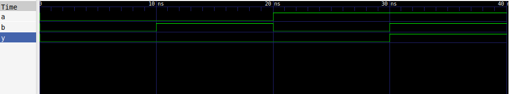

# AND Gate

## Description

A basic 2-input AND gate implemented using Verilog HDL.

## Logic

The output is HIGH only when both inputs are HIGH.

| A | B | Y |
| - | - | - |
| 0 | 0 | 0 |
| 0 | 1 | 0 |
| 1 | 0 | 0 |
| 1 | 1 | 1 |

## Files

* `and_gate.v` — Verilog design
* `and_gate_tb.v` — Testbench

## Simulation Waveform



## Tools

* Verilog HDL
* Icarus Verilog
* GTKWave

## Simulation

Compile:

```bash
iverilog -o and_gate_sim and_gate.v and_gate_tb.v
```

Run:

```bash
vvp and_gate_sim
```

View waveform:

```bash
gtkwave and_gate.vcd
```
