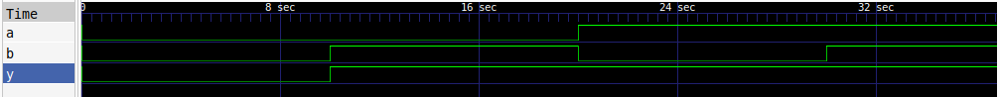

# OR Gate

## Description

A basic 2-input OR gate implemented using Verilog HDL.

## Logic

The output is LOW only when both inputs are LOW.

| A | B | Y |
| - | - | - |
| 0 | 0 | 0 |
| 0 | 1 | 1 |
| 1 | 0 | 1 |
| 1 | 1 | 1 |

## Files

* `or_gate.v` — Verilog design
* `or_gate_tb.v` — Testbench

## Tools

* Verilog HDL
* Icarus Verilog
* GTKWave

## Simulation Waveform



## Simulation

Compile:

```bash
iverilog -o or_gate_sim or_gate.v or_gate_tb.v
```

Run:

```bash
vvp or_gate_sim
```

View waveform:

```bash
gtkwave or_gate.vcd
```
