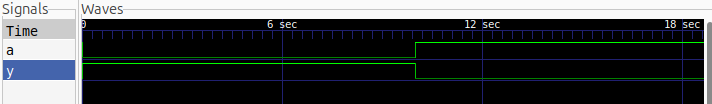

# NOT Gate

A basic NOT gate implemented and simulated using Verilog HDL.

## Logic

The NOT gate produces the complement of its input.

| A | Y |
|---|---|
| 0 | 1 |
| 1 | 0 |

## Simulation Waveform

The NOT gate was simulated using Icarus Verilog and the waveform was viewed using GTKWave.

## Files

- `not_gate.v` — Verilog RTL design
- `not_gate_tb.v` — Testbench
- `not_gate.vcd` — Simulation waveform

## Tools

- Verilog
- Icarus Verilog
- GTKWave
