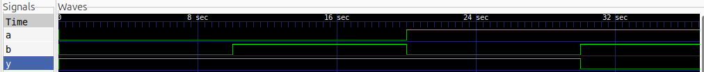

# NAND Gate

A basic NAND gate implemented and simulated using **Verilog HDL**.

## Logic

The NAND gate produces the complement of the AND operation.

$$
Y = \overline{A \cdot B}
$$

| A | B | Y |
| - | - | - |
| 0 | 0 | 1 |
| 0 | 1 | 1 |
| 1 | 0 | 1 |
| 1 | 1 | 0 |

## Simulation Waveform

The NAND gate was simulated using **Icarus Verilog** and the waveform was viewed using **GTKWave**.

## Files

* `nand_gate.v` — Verilog RTL design
* `nand_gate_tb.v` — Testbench
* `nand_gate.vcd` — Simulation waveform
* `waveform.png` — GTKWave waveform screenshot

## Tools

* Verilog HDL
* Icarus Verilog
* GTKWave
