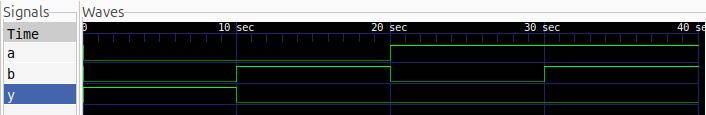

# NOR Gate — Verilog

This project implements and simulates a **2-input NOR gate** using Verilog HDL.

## Logic

A NOR gate is an OR gate followed by a NOT gate.

$$
Y = \overline{A + B}
$$

## Truth Table

| A | B | Y |
| - | - | - |
| 0 | 0 | 1 |
| 0 | 1 | 0 |
| 1 | 0 | 0 |
| 1 | 1 | 0 |

## Simulation

The design was simulated using **Icarus Verilog** and the output waveform was viewed using **GTKWave**.

### Waveform

## Tools Used

* Verilog HDL
* Icarus Verilog
* GTKWave
