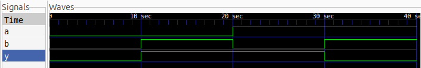

# XOR Gate — Verilog

This project implements and simulates a **2-input XOR (Exclusive OR) gate** using Verilog HDL.

## Logic

An XOR gate produces a logic HIGH (`1`) when the two inputs are different.

$$
Y = A \oplus B
$$

## Truth Table

| A | B | Y |
| - | - | - |
| 0 | 0 | 0 |
| 0 | 1 | 1 |
| 1 | 0 | 1 |
| 1 | 1 | 0 |

## Simulation

The design was simulated using **Icarus Verilog** and the output waveform was viewed using **GTKWave**.

### Waveform

## Tools Used

* Verilog HDL
* Icarus Verilog
* GTKWave
