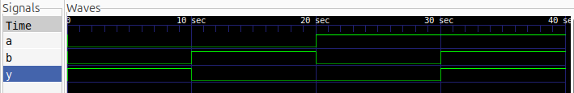

# XNOR Gate

## Description

A basic 2-input XNOR gate implemented using Verilog HDL.

## Logic

The output is HIGH when both inputs are the same.

| A | B | Y |
| - | - | - |
| 0 | 0 | 1 |
| 0 | 1 | 0 |
| 1 | 0 | 0 |
| 1 | 1 | 1 |

## Files

* `xnor_gate.v` — Verilog design
* `xnor_gate_tb.v` — Testbench

## Simulation Waveform



## Tools

* Verilog HDL
* Icarus Verilog
* GTKWave

## Simulation

Compile:

```bash
iverilog -o xnor_gate_sim xnor_gate.v xnor_gate_tb.v
```

Run:

```bash
vvp xnor_gate_sim
```

View waveform:

```bash
gtkwave xnor_gate.vcd
```
