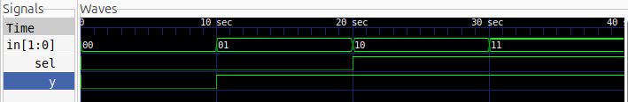

# 2:1 MUX

## Description

A basic 2:1 Multiplexer implemented using Verilog HDL.

## Logic

The select line determines which input is passed to the output.

| Sel | Y     |
| --- | ----- |
| 0   | In[0] |
| 1   | In[1] |

## Files

* `mux2to1.v` — Verilog design
* `mux2to1_tb.v` — Testbench

## Simulation Waveform



## Tools

* Verilog HDL
* Icarus Verilog
* GTKWave

## Simulation

Compile:

```bash
iverilog -o mux2to1_sim mux2to1.v mux2to1_tb.v
```

Run:

```bash
vvp mux2to1_sim
```

View waveform:

```bash
gtkwave mux2to1.vcd
```
