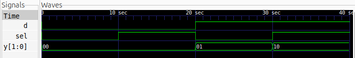

# 1:2 Demux

## Description

A basic 1:2 Demultiplexer implemented using Verilog HDL.

## Logic

The select line determines which output receives the input.

| Sel | Y[1] | Y[0] |
| --- | ---- | ---- |
| 0   | 0    | D    |
| 1   | D    | 0    |

## Files

* `demux1to2.v` — Verilog design
* `demux1to2_tb.v` — Testbench

## Simulation Waveform



## Tools

* Verilog HDL
* Icarus Verilog
* GTKWave

## Simulation

Compile:

```bash
iverilog -o demux1to2_sim demux1to2.v demux1to2_tb.v
```

Run:

```bash
vvp demux1to2_sim
```

View waveform:

```bash
gtkwave demux1to2.vcd
```
