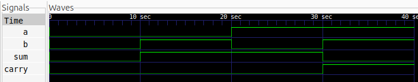

# Half Adder

## Description

A Half Adder is a combinational digital circuit that adds two 1-bit binary numbers and produces a **Sum** and a **Carry** output.

## Logic

* **Sum** = A ⊕ B
* **Carry** = A · B

### Truth Table

| A | B | Sum | Carry |
| - | - | --- | ----- |
| 0 | 0 | 0   | 0     |
| 0 | 1 | 1   | 0     |
| 1 | 0 | 1   | 0     |
| 1 | 1 | 0   | 1     |

## Files

* `half_adder.v` — Half Adder Verilog design
* `half_adder_tb.v` — Testbench
* `half_adder.vcd` — Simulation waveform

## Simulation Waveform



## Tools

* **Verilog**
* **Icarus Verilog**
* **GTKWave**

## Simulation

### Compile

```bash
iverilog -o half_adder_sim half_adder.v half_adder_tb.v
```

### Run

```bash
vvp half_adder_sim
```

### View Waveform

```bash
gtkwave half_adder.vcd
```
