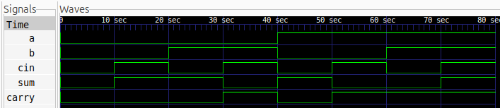

# Full Adder

## Description

A Full Adder is a combinational digital circuit that adds three 1-bit binary inputs and produces a **Sum** and a **Carry** output.

The three inputs are **A**, **B**, and **Cin (Carry In)**.

## Logic

* **Sum** = A ⊕ B ⊕ Cin
* **Carry** = (A · B) + (B · Cin) + (A · Cin)

### Truth Table

| A | B | Cin | Sum | Cout |
| - | - | --- | --- | ---- |
| 0 | 0 | 0   | 0   | 0    |
| 0 | 0 | 1   | 1   | 0    |
| 0 | 1 | 0   | 1   | 0    |
| 0 | 1 | 1   | 0   | 1    |
| 1 | 0 | 0   | 1   | 0    |
| 1 | 0 | 1   | 0   | 1    |
| 1 | 1 | 0   | 0   | 1    |
| 1 | 1 | 1   | 1   | 1    |

## Files

* `full_adder.v` — Full Adder Verilog design
* `full_adder_tb.v` — Testbench
* `full_adder.vcd` — Simulation waveform

## Simulation Waveform



## Tools

* **Verilog**
* **Icarus Verilog**
* **GTKWave**

## Simulation

### Compile

```bash
iverilog -o full_adder_sim full_adder.v full_adder_tb.v
```

### Run

```bash
vvp full_adder_sim
```

### View Waveform

```bash
gtkwave full_adder.vcd
```
